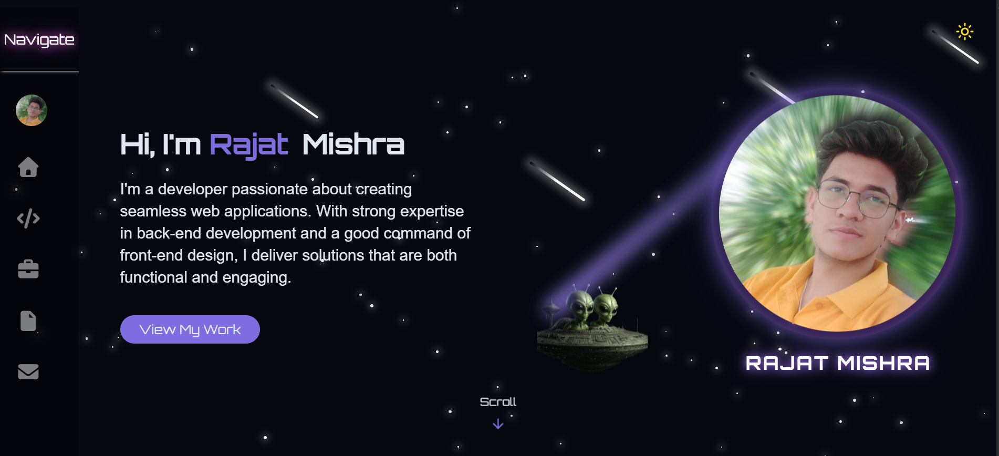
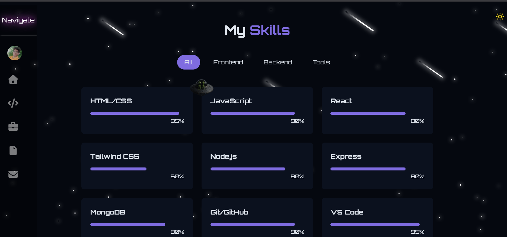
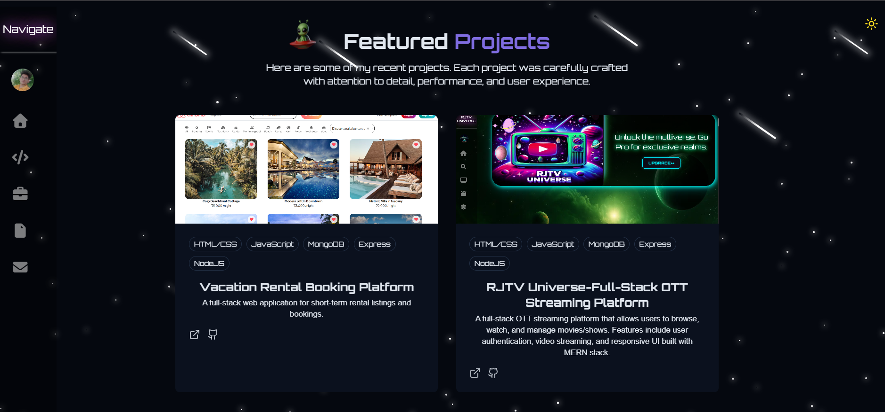

# 🌌 Stellar Night Portfolio

A **personal portfolio website** built with **React** and **Tailwind CSS**, featuring a unique stellar night theme with animations, theme toggle, and a modern responsive design.  
Showcases skills, projects, and achievements in a creative and professional way.  

---

## 🚀 Features
- 🎨 **Stellar Night Theme** with animated meteors and theme toggle (dark/light mode)  
- 💼 **Projects Showcase** with live links and descriptions  
- 🧑‍💻 **Skills Section** highlighting tech stack visually  
- 📱 **Fully Responsive** for desktop, tablet, and mobile  
- ⚡ Smooth animations and clean UI/UX  

---

## 🛠 Tech Stack
- **Frontend:** React.js, Tailwind CSS  
- **Deployment:** Vercel  

---

## 📸 Screenshots
| Hero Section | Skills Section | Projects Section |
|--------------|----------------|------------------|
|  |  |  |

*(Add screenshots of your portfolio UI in the `screenshots/` folder and update the paths accordingly)*  

---

## 🌐 Live Demo
🔗 [View Portfolio](https://my-portfolio-three-green-92.vercel.app/)  

---

## 👨‍💻 Author
**Rajat Mishra**  
- [GitHub](https://github.com/mishraRj)  
- [LinkedIn](https://www.linkedin.com/in/mishrarj/)  

⭐ If you like this project, don’t forget to give it a star!

## 📂 Repository Setup

---

```bash
# Clone the repo
git clone https://github.com/mishraRj/My_Portfolio.git
cd My_Portfolio

# Install dependencies
npm install

# Start the development server
npm run dev
